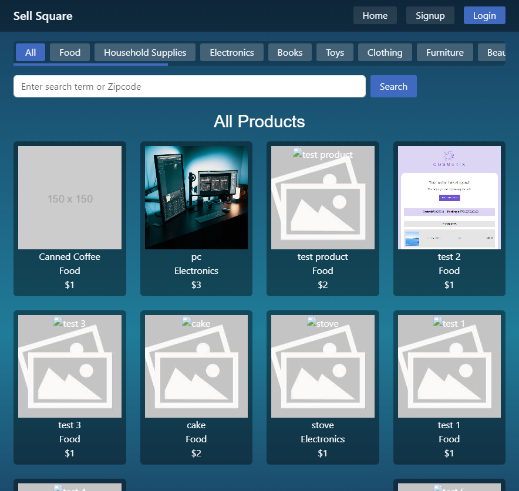

# My Project



<br>

## Description

Sell Square is an online marketplace that connects buyers and sellers. It allowes people to buy and sell many items.  
The platform provides a seamless experience for creating and managing accounts, posting products for sale, and editing or deleting product listings. 

[](https://sell-square.onrender.com/)

<br>


## Table of Content
- [Features](#features)
- [Technologies](#technologies)
- [Getting Started](#getting-started)
- [Installation](#installation)
- [Usage](#usage)
- [Test Instructions](#test-instructions)
- [Author](#author)
- [Contribution](#contribution)
- [Questions](#questions)


<br>

## Features

- **User Profiles**
- **Product Listings**
- **Messaging System**
- **Responsive Design**
- **Admin Dashboard**

<br>

## Technologies

- **Frontend:** React
- **Backend:** Node.js
- **Database:** MongoDB
- **Image Hosting:** Cloudinary
- **Authentication:** JWT (JSON Web Tokens)
- **APIs:** GraphQL
- **Package Management:** npm
- **Styling:** Bootstrap

<br>

## Getting Started

This section will guide you through setting up the project locally. By the end of this guide, you will have a working version of My Project running on your machine.

### Prerequisites

Before you begin, ensure you have the following installed:

- [Node.js](https://nodejs.org/) (v14.0 or later)

- [Git](https://git-scm.com/)

- A text editor like [VSCode](https://code.visualstudio.com/)

<br>

## Installation
Follow these steps to get your development environment set up:
```bash
git clone https://github.com/febres0492/sell-square.git
cd sell-square
npm run install
```

<br>

## Usage
Follow these steps:
```bash
npm start
```

<br>

## Test Instructions
For local testing:
```bash
npm run develop
```

<br>

## Author
**Carlos Febres**

<br>

## Contribution
Contributions are welcome
Please get in contant for details on our code of conduct, and the process for submitting pull requests to us.

<br>

## Questions
For questions please get in contant.  
Github Profile: https://github.com/febres0492  
Email: Febres0492@gmail.com